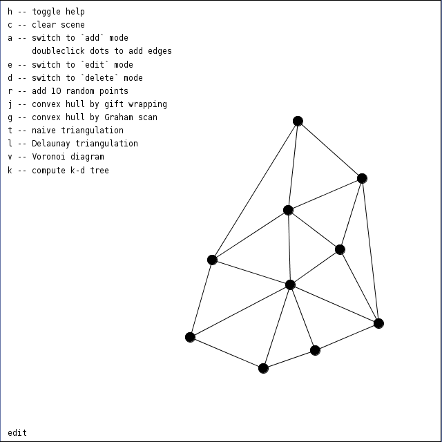

A project implementing the following geometric algorithms with
visualization:

* Gift wrapping algorithm for convex hull,
* Graham scan algorithm for convex hull,
* an algorithm for triangulating convex polygons,
* k-d tree construction (for k = 2),
* Delaunay triangulation,
* Voronoi diagrams.

This project uses the Processing framework with Python mode. Most
algorithms are optimized for code length, not computational complexity.

How to run
----------

There are two options.

* (Linux only) Download [processing.py](https://github.com/jdf/processing.py),
  place this project inside the downloaded folder and run
  `sh processing-py.sh PA093/PA093.pyde`.
* Install `Processing IDE`, open it, install Python mode and open `PA093/PA093.pyde`.

Screenshot
----------

  

